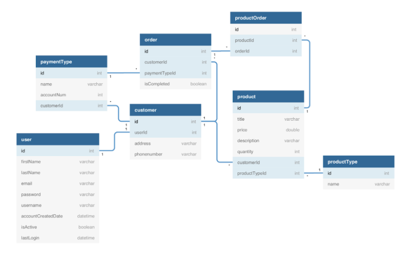

# Welcome to Bangazon

This web application is the source code for the Bangazon e-commerce web site. It is powered by Python and Django.

## Link to ERD



## Helpful Resources

### Django Models and Migrations

Using the requirements above create a [model](https://docs.djangoproject.com/en/1.10/topics/db/models/) for each resource, and use [migrations](https://docs.djangoproject.com/en/1.10/topics/migrations/) to ensure your database structure is up to date.

### Templates

[Django template language](https://docs.djangoproject.com/en/1.10/ref/templates/language/)

### Form Helpers

Django has many built-in [helper tags and filters](https://docs.djangoproject.com/en/1.10/ref/templates/builtins/) when building the site templates. We strongly recommend reading this documentation while building your templates.

This projects utilizes ModelForm

```
class ModelForm
```
If you’re building a database-driven app, chances are you’ll have forms that map closely to Django models. For instance, you might have a BlogComment model, and you want to create a form that lets people submit comments. In this case, it would be redundant to define the field types in your form, because you’ve already defined the fields in your model.


# Core Technologies

## SQLite
### Installation of SQLite (if needed)

To get started, type the following command to check if you already have SQLite installed.

```bash
$ sqlite3
```

And you should see:

```
SQLite version 3.7.15.2 2014-08-15 11:53:05
Enter ".help" for instructions
Enter SQL statements terminated with a ";"
sqlite>
```

If you do not see above result, then it means you do not have SQLite installed on your machine. Follow the appropriate instructions below.

#### For Windows

Go to [SQLite Download page](http://www.sqlite.org/download.html) and download the precompiled binaries for your machine. You will need to download `sqlite-shell-win32-*.zip` and `sqlite-dll-win32-*.zip` zipped files.

Create a folder `C:\sqlite` and unzip the files in this folder which will give you `sqlite3.def`, `sqlite3.dll` and `sqlite3.exe` files.

Add `C:\sqlite` to your [PATH environment variable](http://dustindavis.me/update-windows-path-without-rebooting/) and finally go to the command prompt and issue `sqlite3` command.

#### For Mac

First, try to install via Homebrew:

```
brew install sqlite3
```

If not, download the package from above. After downloading the files, follow these steps:

```
$tar -xvzf sqlite-autoconf-3071502.tar.gz
$cd sqlite-autoconf-3071502
$./configure --prefix=/usr/local
$make
$make install
```

#### For Linux

```
sudo apt-get update
sudo apt-get install sqlite3
```

## SQL Browser  - DB Browser

The [DB browser for SQLite](http://sqlitebrowser.org/) will let you view, query and manage your databases during the course.

## Visual Studio Code

[Visual Studio Code](https://code.visualstudio.com/download) is Microsoft's cross-platform editor that we'll be using during orientation for writing Python and building Django applications. Make sure you add the [Python](https://marketplace.visualstudio.com/items?itemName=ms-python.python) extension immediately after installation completes.

## Python

This project uses Python and its web framework Django.

[Python Getting Started](https://www.python.org/about/gettingstarted/)

[Download Python](https://www.python.org/downloads/)

If you are using a Mac, see the [Python for Mac OS X](https://www.python.org/downloads/mac-osx/) page. MacOS 10.2 (Jaguar), 10.3 (Panther), 10.4 (Tiger) and 10.5 (Leopard) already include various versions of Python.

If you're running Windows: the most stable Windows downloads are available from the [Python for Windows](https://www.python.org/downloads/windows/) page.


## Setup Virtual Environment 

Enable a virtual environment at the level above your project.

Use the following commands in your terminal:
```
virtualenv env
source env/bin/activate
```
## Dependencies

Activate your vim and run `pip install -r requirements.txt`


### Django Project / Django App

Django is a Python Web framework. This project uses Django and requires Python to be installed. See above note on installing Python.

[Django Install](https://docs.djangoproject.com/en/2.1/topics/install/)

[Django for Windows](https://docs.djangoproject.com/en/2.1/howto/windows/)

# Installing Bangazon

As of now, the database is going to be hosted on your local computer. There are a few things you need to make sure are in place before the database can be up and running.

1. Fork and clone the repo on to you local machine. 

2. Run makemigrations
`python manage.py makemigrations website`

3. Run migrate
`python manage.py migrate`
>This will create all the migrations needed for Django Framework to post items to the database based on the models in the Models/ directory

4. Add initial data
`python manage.py loaddata db.json`
>This will load data from the project's json file to your local database

## Run Server

`python manage.py runserver 8000`
Ctrl+C to quit

## Using the App
`http://localhost:8000` is the domain you will use to access the app.

### Index
Once you access `http://localhost:8000` you will be directed to the main page where the latest 20 products are listed.

If you are not logged in you will see a navigation bar with the following links:
Bangazon(Home Page), Product Categories, My Account, Register, and Login

Once you login you will see a navigation bar as follows:
Bangazon(Home Page), Product Categories, Sell Product, My Account, Log Out, and a search feature to find items by keyword.

### Product Categories 
`http://localhost:8000/product_cat/`
Displays a listing of product categories with a total number of products in that category to the right of the category name.  Additionally, you will see the last three products added to the category.

### Sell Product
`http://localhost:8000/product_sell/`
Displays a form allowing a user to add product to sell on Bangazon.  This link will only be visible to authenticated users.  The person filling out the form will be able to enter a title, description, price, quantity, and a product type.

### My Account
`http://localhost:8000/my_account/`
Displays the customer information related to the logged in user.  There the user will see address, phone number, a button for payment methods, and a link to order history.

    Payment Methods:
        Displays a list of all available payment methods for the user.  The user will also have the ability to delete payment methods from this screen.
    Order History:
        Displays a list of the user's order history with links to the order details.  The order details will include information about each line item incuding price.  The order total will also be displayed.

### Search
example of a search for 'mustang': `http://localhost:8000/search_results/?q=mustang`
Functionality that enables the user to search Bangazon using keywords.  Once a user enters a search term in the search box they will be redirected to a list of results when they either click search or 'enter'


This repo created by the Talkative Tangs of Cohort 28:


[Lesley Boyd](https://github.com/laboyd001) - Team Lead

[Bryan Nilsen](https://github.com/BryanNilsen)

[Ousama Elayan](https://github.com/ousamasama/)

[Elyse Dawson](https://github.com/CurtainUp)
